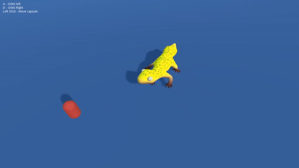

# Gecko
Procedural animation in Godot Engine

This is a project made using a procedural animation Unity Engine tutorial by https://twitter.com/Weaver_Dev (https://www.weaverdev.io/blog/bonehead-procedural-animation), while also using some code from the IK Godot demo (https://github.com/godotengine/godot-demo-projects/tree/master/3d/ik) (blender model is in it)

